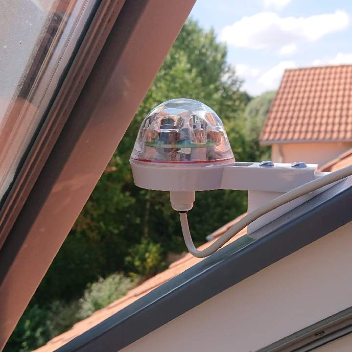

# fhem-EMCDDevice-rg9

Description and data for my home automation project of integrating a rg9 rainsensor (https://rainsensors.com/products/rg-9/) into FHEM home automation system by using an ESPEasy ser2net on a WT32-ETH01.

This project contains:
- classdef file for EMCDDevice of FHEM
- CAD and STL of
-- wedge for roof mounting
-- housing for WT32-ETH01 
- schematics of connecting rg9 sensor to WT32-ETH01

WT32-ETH01 is setup with ESPEasy and ser2net module, which works reliable with EMCDDevice in FHEM.
It is set up like this:

Note: have some trouble with current regexp with "TooCold" receive string in classdef file
